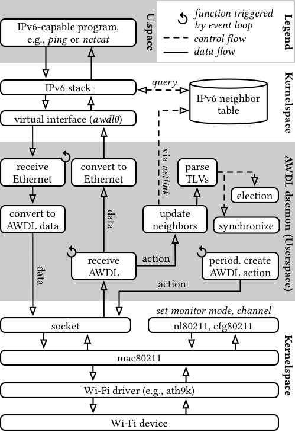

# Open Wireless Link

Open Wireless Link (OWL) is an open implementation of the Apple Wireless Direct Link (AWDL) ad hoc protocol for Linux and macOS written in C and part of the [Open Wireless Link project](https://owlink.org).

OWL runs in userspace and makes use of Linux’s Netlink API for Wi-Fi specific operations such as channel switching and to integrate itself in the Linux networking stack by providing a virtual network interface such that existing IPv6-capable programs can use AWDL without modification.


## Disclaimer

OWL is experimental software and is the result of reverse engineering efforts by the [Open Wireless Link](https://owlink.org) project.
Therefore, it does not support all features of AWDL or might be incompatible with future AWDL versions.
OWL is not affiliated with or endorsed by Apple Inc. Use this code at your own risk.


## Requirements

To use OWL, you will need a Wi-Fi card supporting active monitor mode with frame injection. We recommend the Atheros AR9280 chip (IEEE 802.11n) which we used to develop and test this code. Configurations that do not support *active* monitor mode, i.e., ACK received frames, might suffer from throughput degradation because the sender will re-transmit each frame up to 7 times as per the IEEE 802.11 standard. Have a look at [this issue](https://github.com/seemoo-lab/owl/issues/9) if you want to find out whether your card meets the requirements.


## Installation

If you're an Arch Linux user, then you can install `owl` from the
[`owl-git` AUR package](https://aur.archlinux.org/packages/owl-git/), e.g.,

```sh
yay -S owl-git
```


## Build from source

The project is build using CMake. To build the project, simply clone this repositry in `<OWLDIR>` and run
```sh
cd <OWLDIR>
git submodule update --init
mkdir build
cd build
cmake ..
make
sudo make install
```

OWL requires `libpcap` for frame injection and reception, `libev` for event handling, and `libnl` (Linux only) for interactions with the system's networking stack which have to be installed on the target system.

On Debian Linux,
```sh
sudo apt install libpcap-dev libev-dev libnl-3-dev libnl-genl-3-dev libnl-route-3-dev
```
On Fedora,
```sh
sudo dnf install libpcap-devel libev-devel libnl3-devel
```
On macOS, you need to add support for tun/tap devices, e.g., via [tuntaposx](http://tuntaposx.sourceforge.net). You can install it via [Homebrew](https://brew.sh):
```sh
brew cask install tuntap
```

## Use

Simply run

```sh
sudo owl -i <WLAN_IFACE>
```

You may increase the log level with `-v` and `-vv` and daemonize the program with `-D`. For other options, have a look at `daemon/owl.c`.

When started, OWL creates a virtual network interface `awdl0` with a link-local IPv6 address. Discovered AWDL peers are automatically added (and removed) to (and from) the system's neighbor table. Run `ip n` to see a list of all current neighbors.


## Architecture

The following figure shows the core structure of OWL.




## Code Structure

We provide a coarse structure of the most important components and files to facilitate navigating the code base.

* `daemon/` Contains the active components that interact with the system.
  * `core.{c,h}` Schedules all relevant functions on the event loop.
  * `io.{c,h}` Platform-specific functions to send and receive frames.
  * `netutils.{c,h}`  Platform-specific functions to interact with the system's networking stack.
  * `owl.c` Contains `main()` and sets up the `core` based on user arguments.
* `googletest/` The runtime for running the tests.
* `radiotap/` Library for parsing Radiotap headers.
* `src/` Contains platform-independent AWDL code.
  * `channel.{c,h}` Utilities for managing the channel sequence.
  * `election.{c,h}` Code for running the election process.
  * `frame.{c,h}` The corresponding header file contains the definitions of all TLVs.
  * `peers.{c,h}` Manages the peer table.
  * `rx.{c,h}` Functions for handling a received data and action frames including parsing TLVs.
  * `schedule.{c,h}` Functions to determine *when* and *which* frames should be sent.
  * `state.{c,h}` Consolidates the AWDL state.
  * `sync.{c,h}` Synchronization: mangaging (extended) availability windows.
  * `tx.{c,h}` Crafting valid data and action frames ready for transmission.
  * `version.{c,h}` Parse and create AWDL version numbers.
  * `wire.{c,h}` Mini-library for safely reading and writing primitives types from and to a frame buffer.
* `tests/` The actual test cases for this repository.
* `README.md` This file.


## Current Limitations/TODOs

* OWL uses static election metric and counter values, so it either takes part as a slave (low values) or wins the election (high values). See `AWDL_ELECTION_METRIC_INIT` and `AWDL_ELECTION_COUNTER_INIT` and in `include/election.h`.
* The channel sequence does not adjust itself automatically to current network load and/or other triggers. This would require a better understanding of Apple's implementation. Currently, the channel sequence is fixed when initalizing. See `awdl_chanseq_init_static()` in `src/state.{c,h}`.
* OWL does not allow a concurrent connection to an AP. This means, that when started, the Wi-Fi interface exclusively uses AWDL. To work around this, OWL could create a new monitor interface (instead of making the Wi-Fi interface one) and adjust its channel sequence to include the channel of the AP network.


## Our Papers

* Milan Stute, Sashank Narain, Alex Mariotto, Alexander Heinrich, David Kreitschmann, Guevara Noubir, and Matthias Hollick. **A Billion Open Interfaces for Eve and Mallory: MitM, DoS, and Tracking Attacks on iOS and macOS Through Apple Wireless Direct Link.** *28th USENIX Security Symposium (USENIX Security ’19)*, August 14–16, 2019, Santa Clara, CA, USA. [Link](https://www.usenix.org/conference/usenixsecurity19/presentation/stute)

* Milan Stute, David Kreitschmann, and Matthias Hollick. **One Billion Apples’ Secret Sauce: Recipe for the Apple Wireless Direct Link Ad hoc Protocol.** *The 24th Annual International Conference on Mobile Computing and Networking (MobiCom '18)*, October 29–November 2, 2018, New Delhi, India. ACM. [doi:10.1145/3241539.3241566](https://doi.org/10.1145/3241539.3241566)

* Milan Stute, David Kreitschmann, and Matthias Hollick. **Demo: Linux Goes Apple Picking: Cross-Platform Ad hoc Communication with Apple Wireless Direct Link.** *The 24th Annual International Conference on Mobile Computing and Networking (MobiCom '18)*, October 29–November 2, 2018, New Delhi, India. ACM. [doi:10.1145/3241539.3267716](https://doi.org/10.1145/3241539.3267716)


## Contact

* **Milan Stute** ([email](mailto:mstute@seemoo.tu-darmstadt.de), [web](https://seemoo.de/mstute))
